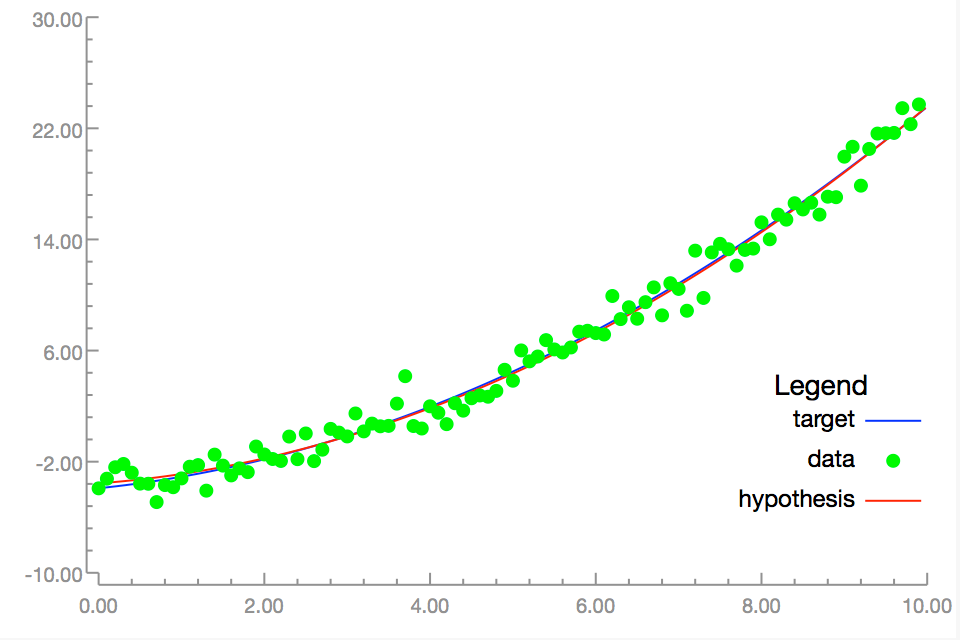
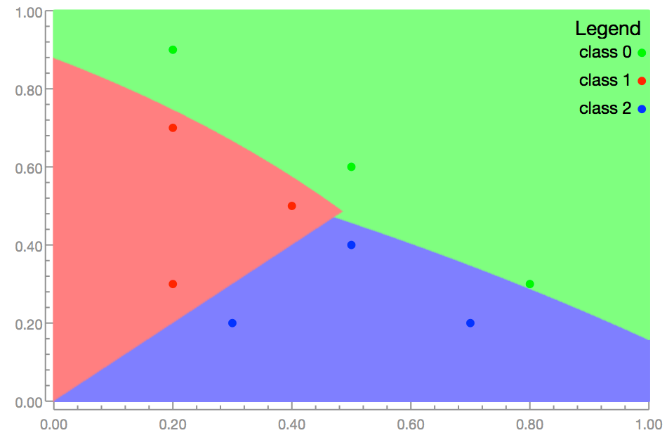

# AIToolbox
A toolbox of AI modules written in Swift:  Graphs/Trees, Linear Regression, Support Vector Machines, Neural Networks, PCA, KMeans, Genetic Algorithms, MDP, Mixture of Gaussians, Logistic Regression

This framework uses the Accelerate library to speed up computations.
Written for Swift 2.2.  Will update to 3 when officially released

SVM ported from the public domain LIBSVM repository
See https://www.csie.ntu.edu.tw/~cjlin/libsvm/ for more information

The Metal Neural Network uses the Metal framework for a Neural Network using the GPU.  While it works in preliminary testing, more work could be done with this class

Use the XCTest files for examples on how to use the classes

###NEW - Playgrounds for Linear Regression and SVM!

Classes/Algorithms supported:

    Graphs/Trees
        Depth-first search
        Breadth-first search
        Hill-climb search
        Beam Search
        Optimal Path search

    Alpha-Beta (game tree)

    Genetic Algorithms
        mutations
        mating
        integer/double alleles

    Constraint Propogation
        i.e. 3-color map problem

    Linear Regression
        arbitrary function in model
        regularization can be used
        convenience constructor for standard polygons
        Least-squares error

    Non-Linear Regression
        parameter-delta
        Gradient-Descent
        Gauss-Newton

    Logistic Regression
        Use any non-linear solution method
        Multi-class capability

    Neural Networks
        multiple layers, several non-linearity models
        on-line and batch training
        feed-forward or simple recurrent layers can be mixed in one network
        simple network training using GPU via Apple's Metal

    Support Vector Machine
        Classification
        Regression
        More-than-2 classes classification

    K-Means
        unlabelled data grouping

    Principal Component Analysis
        data dimension reduction

    Markov Decision Process
        value iteration
        policy iteration
        fitted value iteration for continuous state MDPs - uses any Regression class for fit
                (see my MDPRobot project on github for an example use)

    Gaussians
        Single variable
        Multivariate - with full covariance matrix or diagonal only

    Mixture Of Gaussians
        Learn density function of a mixture of gaussians from data
        EM algorithm to converge model with data

    Validation
        Use to select model or parameters of model
        Simple validation (percentage of data becomes test data)
        N-Fold validation

    Plotting
        NSView based MLView for displaying regression data, classification data, functions, and classifier areas!

## License

This framework is made available with the [Apache license](LICENSE.md).

##  Contributions

See the [contribution document](CONTRIBUTIONS.md) for information on contributing to this framework